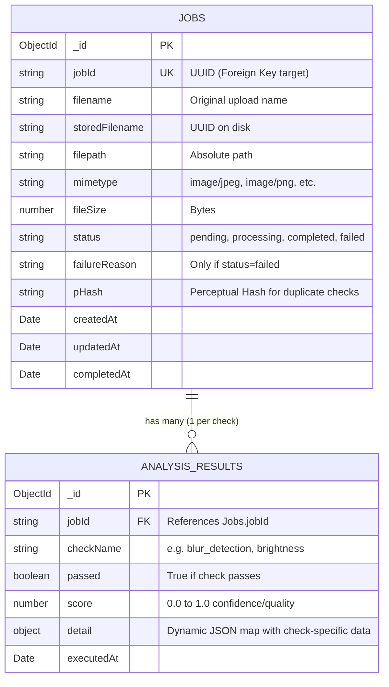

# Database Architecture & Design

This document outlines the database schema, relationships, and the rationale behind the design choices for the Intelligent Media Processing Pipeline.

## 1. Schema Visualization

The system uses a NoSQL document database (MongoDB) composed of two primary collections. They are logically linked via the `jobId` field.

## 2. Why MongoDB?

Given the requirements of the pipeline, **MongoDB** was chosen over a relational database (like PostgreSQL or MySQL) for several critical reasons:

1. **Polymorphic Data Structures (`detail` field):**
   Every analysis check produces a completely different set of metadata. For example, blur detection outputs a `laplacianVariance` number, while OCR outputs an `extractedText` string. Relational databases would require either rigid, sparse tables (many NULL columns) or relying entirely on a `JSONB` column. MongoDB natively embraces dynamic document structures, allowing the `detail` object to seamlessly adapt to any new heuristic we add.

2. **Atomic Document Updates:**
   As the image moves through the pipeline, its state changes rapidly (`pending -> processing -> completed`). MongoDB's atomic document-level updates (`findOneAndUpdate`) make it incredibly safe and efficient to update the job status concurrently without complex table locks.

3. **Schema Evolution:**
   In an AI/Computer Vision pipeline, the types of checks and data extracted will evolve constantly. A NoSQL approach prevents the need for constant database migrations every time a new analysis module is introduced.

## 3. Why Two Collections Instead of One?

You might wonder: *Why not just embed the analysis results directly into the `Jobs` document as an array?*

While MongoDB supports document embedding, we chose a two-collection design (`jobs` and `analysis_results`) because:

1. **Worker Isolation & Concurrency:**
   The background worker executes all 6 analysis checks in parallel using `Promise.allSettled()`. If all checks tried to push their results into a single `Job` document array simultaneously, we could encounter race conditions or high lock contention on that single document. By giving each result its own document, the database handles parallel writes perfectly.

2. **Retry Resilience:**
   By decoupling the results, if the worker crashes midway through processing an image, we don't end up with half-embedded, corrupt data in the Job document. The `AnalysisResultModel.updateOne(..., { upsert: true })` logic ensures that on a worker retry, we cleanly overwrite or skip existing check results without array-duplication bugs.

3. **Query Optimization:**
   If we want to build an analytics dashboard later (e.g., "Show me all images that failed the OCR check today"), it is significantly faster to query an indexed `analysis_results` collection than it is to unwind and search inside nested arrays across millions of `Job` documents.

## 4. Key Database Indexes

To ensure the system remains performant at scale, we applied the following indexes:
* **`jobs` collection:** Indexed on `jobId` (unique lookup), `status` (for polling queues), and `createdAt` (for dashboard sorting).
* **`analysis_results` collection:** Indexed on `jobId` (to fetch all checks for a job instantly) and a unique compound index on `{ jobId: 1, checkName: 1 }` to prevent accidental duplicate check results during queue retries.
